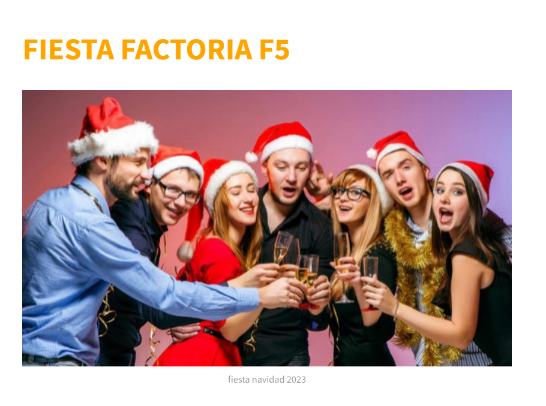

# Proyecto computer vision: Aplicación de reconocimiento facial
## Descripción del proyecto
Este proyecto es la culminación de la innovación tecnológica que busca simplificar y acelerar el proceso de entrada a eventos, en particular, la próxima gran fiesta organizada por factoria F5. La visión es permitir que los empleados disfruten de un acceso fluido y sin complicaciones simplemente acercándose a un portátil habilitado con nuestro sistema de reconocimiento facial basado en deep learning. La inteligencia artificial se encargará de identificar y verificar la identidad de los empleados en tiempo real, proporcionando una experiencia de entrada eficiente y segura.

## Tecnologías utilizadas
- python
- face_recognition
- streamlit
## Características principales
- Reconocimiento en Tiempo Real: Utilizamos la biblioteca face_recognition para detectar rostros en tiempo real a través de una cámara.
  
- Identificación de Empleados: El sistema identificará si la persona frente a la cámara es un empleado registrado.  
- Reconocimiento multicara.
- Sin Datos Externos: Todos los datos utilizados para el entrenamiento del modelo son generados internamente, sin depender de fuentes externas.  
- Despliegue en Ordenador Portátil: El modelo y los datos se ejecutan localmente en un ordenador portátil, garantizando la privacidad de los datos.  
- Interfaz amigable.
# Instrucciones de instalación
A continuación, se detallan los pasos para instalar y ejecutar el proyecto en tu ordenador portátil. 
1. Clonar el repositorio:
https://github.com/AI-School-F5-P2/Reconocimiento_facial_equipo12.git 
2. Instalar las dependencias:
pip install -r requirements.txt 
3. Crear una carpeta faces donde incluirá las fotos de los rostros que quiera reconocer.
4. Ejecute la aplicación:
streamlit run app.py
# Contribuciones
Las contribuciones son bienvenidas!!
Sigue estos pasos si quieres contribuir:
1. Forkea el Repositorio:
Haz un fork de este repositorio a tu cuenta. Esto creará una copia del proyecto en tu espacio personal.

2. Crea una Nueva Rama:
Crea una rama para trabajar en tu nueva característica o solucionar un problema:
git checkout -b feature/nueva-caracteristica
Utiliza un nombre de rama descriptivo y específico.

3. Haz tus Cambios:
Realiza los cambios necesarios en tu rama. Añade nuevos archivos, realiza modificaciones y asegúrate de seguir las mejores prácticas de codificación.

4. Realiza un Commit:
Haz commit de tus cambios con un mensaje descriptivo:
git commit -m "Añade nueva característica: descripción corta" 

5. Envía un Pull Request (PR):
Empuja tu rama al repositorio remoto y abre un Pull Request en GitHub. Proporciona detalles sobre los cambios que has realizado y cualquier información adicional relevante.

6. Revisión y Comentarios:
Tu PR será revisado y, si es necesario, se te proporcionarán comentarios. Asegúrate de estar abierto a sugerencias y mejoras.
7. Merge del PR:
Una vez que el PR haya sido revisado y aprobado, se realizará el merge a la rama principal del proyecto.
# Contacto
Miguel Mendoza

Verónica Bermejo Gómez   vero_bermejo@hotmail.com  

https://www.linkedin.com/in/ver%C3%B3nica-bermejo-g%C3%B3mez/

### ¡Gracias por ser parte del Proyecto CV - Reconocimiento Facial! ¡Diviértete en la fiesta! 🎉
